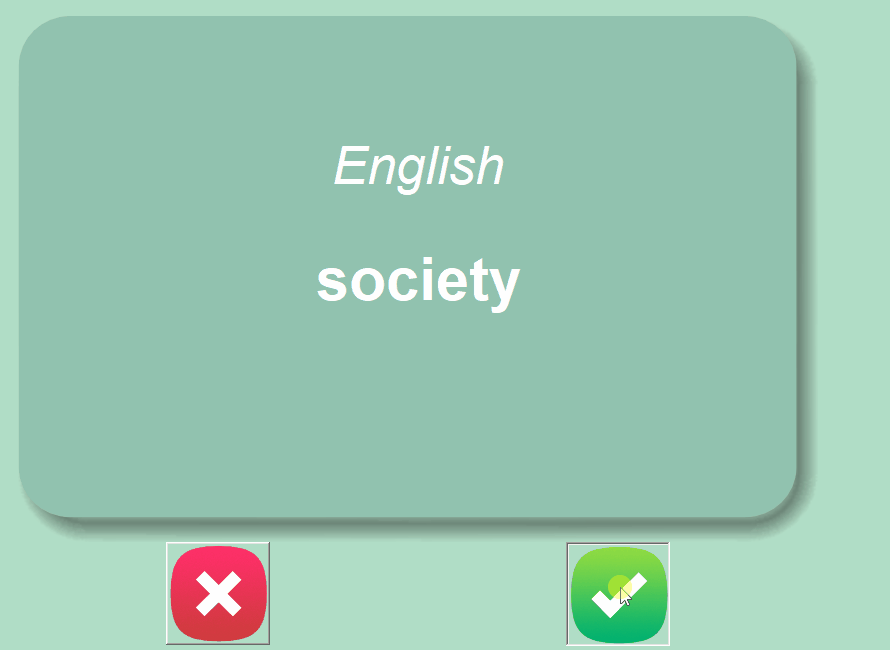

# Flashy - App de Flashcards para Idiomas

Este é um aplicativo simples para te ajudar a aprender novas palavras em qualquer idioma ou assunto usando flashcards.

## 💡 Como Funciona




- O programa mostra uma palavra no idioma que você está aprendendo.
- Após **3 segundos**, o card vira e mostra a **tradução**.
- Clique no botão ✔️ (certo) se você **já sabe** a palavra. Ela será **removida** do seu baralho de estudos.
- Clique no botão ❌ (errado) se você **não sabe** a palavra, para que ela continue aparecendo.
- O seu **progresso é salvo automaticamente!**

O app cria dois arquivos:

- `words_to_learn.csv`: Guarda as palavras que você **ainda precisa praticar**.
- `words_learned.csv`: Guarda as palavras que você **já marcou como aprendidas**.

---

## 🚀 Como Usar (Guia Rápido)

É muito fácil configurar e usar o aplicativo para qualquer idioma.

### 1. Prepare seu arquivo de palavras

Dentro da pasta `data`, crie um arquivo chamado `source_data.csv`.

Este arquivo precisa ter **duas colunas**: uma para o idioma que você quer aprender e outra para a tradução.

> ⚠️ **Importante:** O nome que você der para as colunas será usado no código!

#### Exemplo de `source_data.csv` para Alemão/Inglês:

```csv
Deutsh,English
hallo,hello
danke,thanks
bitte,please

```
### 2. Configure o Código
Abra o arquivo main.py e ajuste apenas duas linhas no topo:

### --- CONSTANTS ---
#### LEARNING_LANGUAGE = "Deutsh"        # Deve ser igual ao cabeçalho no CSV
#### TRADUCTION_LANGUAGE = "English"     # Deve ser igual ao cabeçalho no CSV

### 3. Instale a dependência e execute
Se você ainda não tem a biblioteca pandas, abra o terminal e instale com:

```bash
pip install pandas
```
Agora, é só executar o arquivo main.py para começar a estudar! 🎉

Feito com 💙 por Cecília Zica

